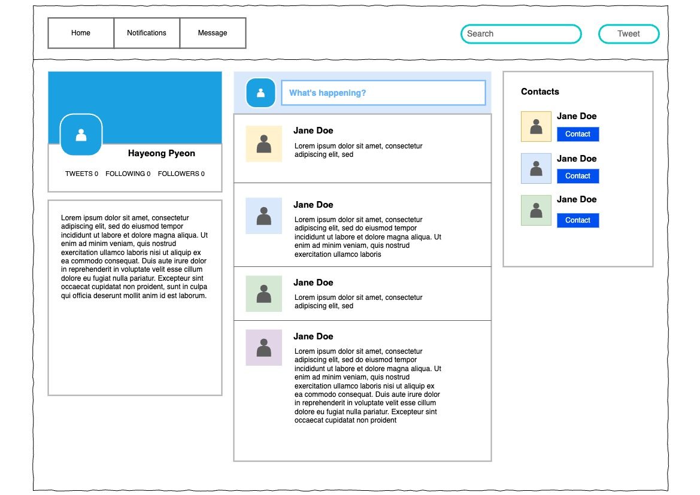

# Social Media Dashboard

By Hayeong

## Description

- This is an in-class practice in **React Fundamentals** course provided by Epicodus. 
- This project is to review React components, practice planning the project with draw.io, and creating a social media platform application (non-functional this time). 

## Planning (diagram)

## Github Pages Link
https://hypyeon.github.io/React-socialMediaDashboard/

## Setup Requirements
1. Clone this repository to your desktop and open it with a text editor.
2. Install all packages with `npm install` on terminal.
3. Build the project using webpack with `npm run build`.
4. Start a development server with `npm run start`.

## License
[MIT](/LICENSE.txt) Copyright © 2024 Hayeong Pyeon